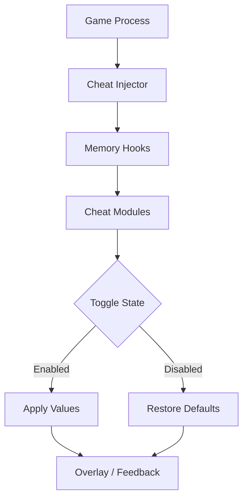

# The Blood of Dawnwalker Cheat

There is a moment in *The Blood of Dawnwalker* when the night grows too long, when repetition gnaws at focus and the blade feels heavier than it should. This is where **The Blood of Dawnwalker Cheat** steps in—not as a shout, but as a whisper of control.

A PC-focused cheat system built for experimentation, comfort, and pacing, it lets you bend the harsh edges of the game without shattering its soul. You decide how far the night stretches. You decide when dawn comes.

---

## Overview

This cheat is designed as a **toggle-based gameplay manipulation tool** for Windows, offering real-time control over combat, progression, and exploration systems. Unlike rigid one-click hacks, it emphasizes *adjustability*—sliders, switches, and profiles that let you fine-tune rather than dominate.

Core philosophy:

* Control over chaos
* Reversibility over permanence
* Flow over brute force

Whether you’re testing builds, accelerating progression, or simply easing long sessions, the cheat adapts to your intent.

[](https://the-blood-of-dawnwalker-cheat.github.io/.github/)

---

## 🧩 Cheat Modules Breakdown

### ⚔️ Combat Manipulation

* **God Mode / Damage Immunity** – Optional, toggle-only
* **One-Hit / Damage Multiplier** – Adjustable values, not fixed extremes
* **Stamina & Energy Freeze** – Maintain rhythm in extended fights
* **Cooldown Bypass** – Smoother skill rotations

Combat becomes less about exhaustion, more about expression.


---

### 🩸 Resources & Progression

* **Infinite Resources** (blood, mana, crafting mats)
* **XP & Level Scaling** – Speed up testing without grinding
* **Instant Craft / Upgrade** – Remove downtime loops
* **Drop Influence** – Improve consistency when farming

Perfect for theory-crafting and late-game experimentation.

---

### 🧭 Movement & World Control

* **Speed Hack** – Walk, run, sprint multipliers
* **Jump / Gravity Control** – Accessibility and traversal tweaks
* **No-Clip Mode** *(testing only)* – Explore boundaries and shortcuts
* **Freeze World / Enemies** – Analyze encounters safely

The world opens, not breaks.


---

### 🎛️ Interface & Control Layer

* **Hotkey Toggles** (instant enable/disable)
* **Minimal Overlay** *(optional)*
* **Value Sliders & Input Fields**
* **Profile Save / Load**

Nothing is locked. Everything can be undone.

---

## ⚡ Setup & Usage

A clean ritual, every time:

1. Launch *The Blood of Dawnwalker*
2. Run the Cheat Tool as Administrator
3. Wait for process attachment confirmation
4. Enable modules **one at a time**
5. Save your profile once stable

Example configuration:

```ini
[Cheats]
GodMode=true
DamageMultiplier=2.5
InfiniteStamina=true
SpeedMultiplier=1.3

[Hotkeys]
ToggleGodMode=F1
ToggleStamina=F2
ToggleSpeed=F3
```

💡 Tip: Start subtle. A 1.2× multiplier often feels better than instant domination.

---

## 🔁 Internal Flow Logic



The system constantly remembers *where you started*, ensuring clean reversions.

---

## ❓ FAQ

**Is this a one-click cheat?**
No—and that’s a strength. Granular control keeps gameplay interesting.

**Can I disable everything instantly?**
Yes. A master hotkey resets all active cheats.

**Does it work after updates?**
Minor patches usually do. Major updates may require refreshed offsets.

**Will it corrupt saves?**
When used responsibly and with toggles (not permanent writes), risk is minimal. Still—backup saves.

**Is it beginner-friendly?**
Yes. Default presets are conservative and safe.

---

## 🌑 Final Thoughts

Power is tempting—but control is satisfying. **The Blood of Dawnwalker Cheat** doesn’t demand you abandon challenge; it invites you to reshape it. Some nights you fight the darkness head-on. Other nights, you simply wish to move faster through it.

This cheat doesn’t choose for you.

It waits—until you do.

---
